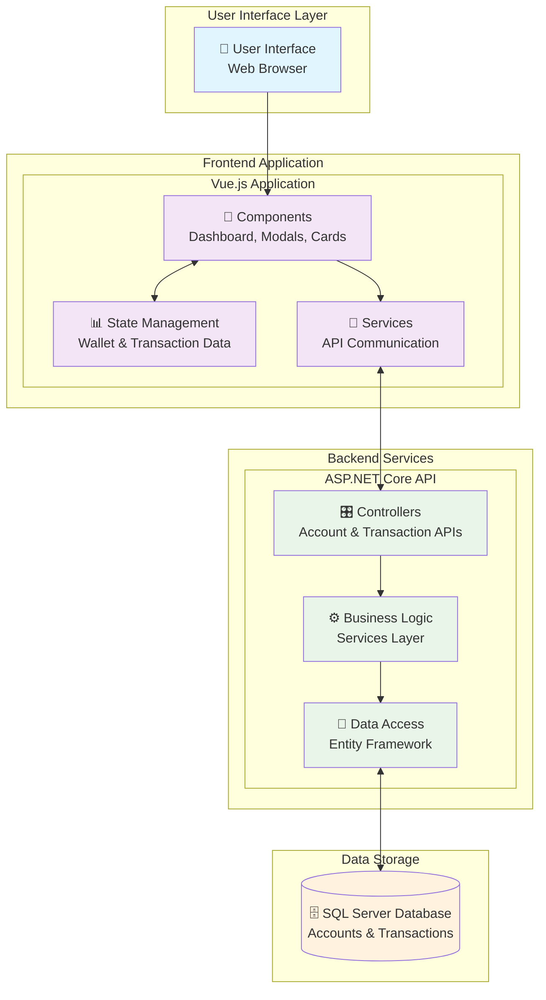
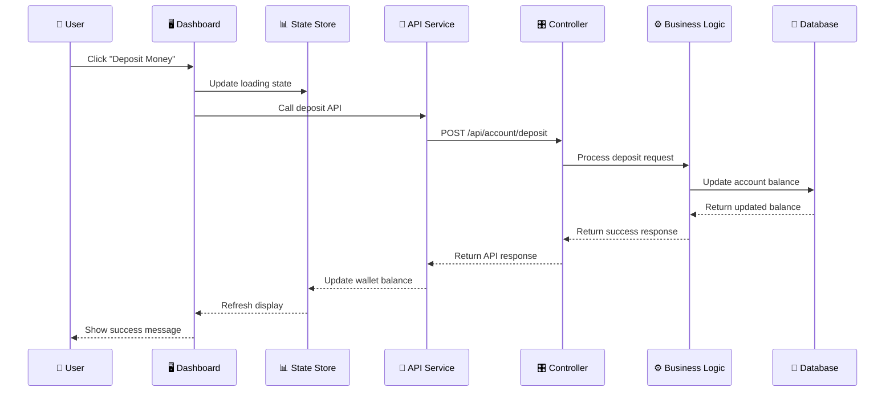
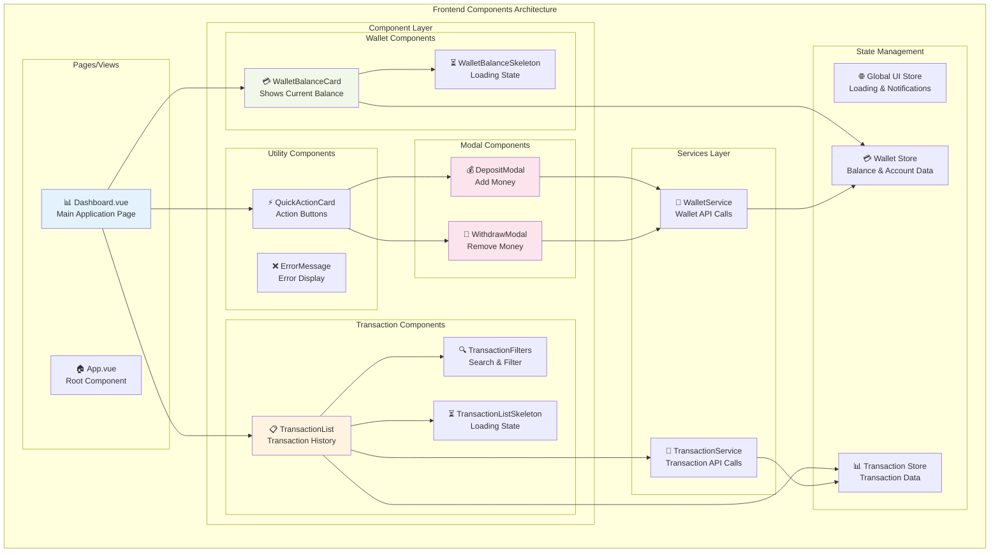
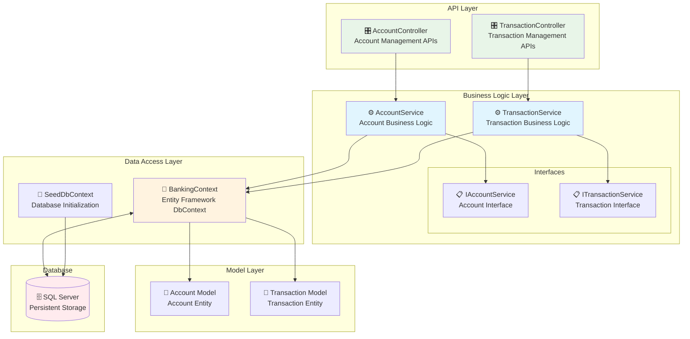
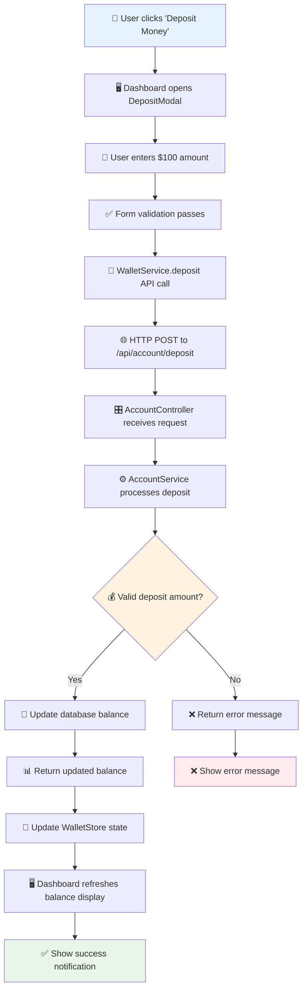
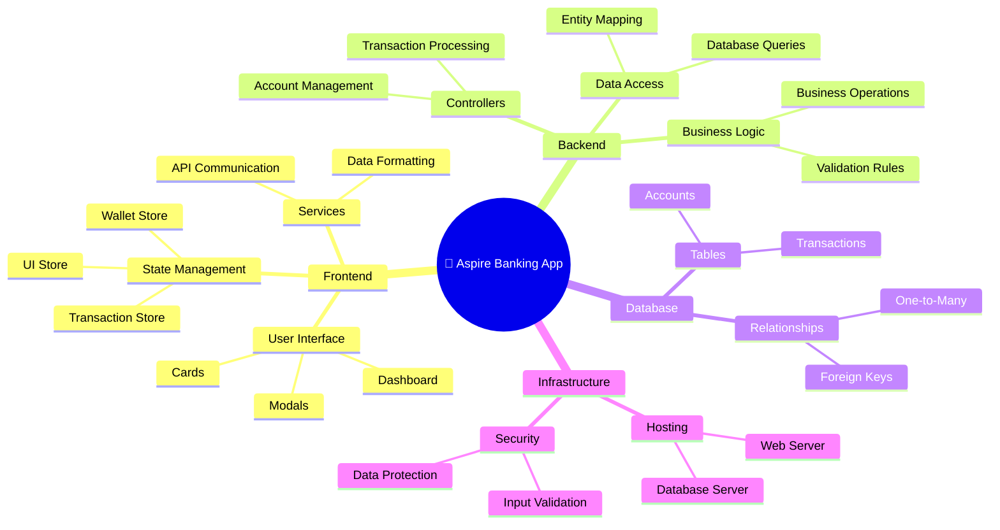

# Aspire Financial Application

A comprehensive financial management application built with Vue.js frontend and ASP.NET Core backend, designed for transaction management, wallet operations, and financial analytics.

## 🏗️ System Architecture Overview

### High-Level Architecture Diagram



## 🔄 Data Flow Architecture



## 🏢 For Non-Technical Explanation

Think of this application like a **digital bank branch** with different departments working together:

### The Reception Desk (User Interface)
- This is what you see and interact with on your screen
- Like the front desk at a bank where you make requests
- Has buttons for "Deposit Money", "Withdraw Money", "View Transactions"

### The Customer Service Representative (Frontend Components)
- Takes your requests and translates them into actions
- Shows you your account balance, transaction history
- Handles forms when you want to deposit or withdraw money
- Like a helpful bank teller who guides you through processes

### The Communication System (Services & API)
- Like the internal phone system that connects different departments
- Carries your requests from the front desk to the back office
- Brings back responses and updates to show you

### The Back Office (Backend Controllers & Business Logic)
- Where the actual work happens
- Processes your deposit/withdrawal requests
- Checks if you have enough money for withdrawals
- Applies business rules (like minimum balance requirements)
- Like the bank managers who approve transactions

### The Vault (Database)
- Securely stores all your account information
- Keeps track of every transaction you've ever made
- Maintains your current balance
- Like the bank's secure record-keeping system

### How They Work Together:
1. **You click "Deposit $100"** → Reception desk receives your request
2. **Request gets processed** → Customer service rep prepares the paperwork
3. **Sent to back office** → Communication system delivers the request
4. **Back office processes** → Managers verify and approve the deposit
5. **Vault gets updated** → Your balance increases by $100
6. **Confirmation sent back** → All departments get notified
7. **You see success message** → Reception desk shows you the update

The application follows a modern full-stack architecture with clear separation of concerns:

- **Frontend**: Vue.js 3 with TypeScript
- **Backend**: ASP.NET Core Web API
- **Database**: Entity Framework Core with SQL Server
- **Architecture Pattern**: Clean Architecture with MVC pattern

## 🧩 Component Architecture Diagram



## 🔧 Backend Service Architecture



## 📁 Project Structure

## 🔄 Real-World Process Flow

Let's trace what happens when you **deposit $100** into your account:



## 🏗️ System Integration Overview



## 🎯 Simple Component Connections

Think of each component like **LEGO blocks** that snap together:

### 🏠 The Main House (Dashboard)
- **What it does**: The main screen you see
- **Connected to**: Wallet balance card, transaction list, action buttons
- **Like**: The living room where everything comes together

### 💳 The Wallet Display (WalletBalanceCard)
- **What it does**: Shows how much money you have
- **Connected to**: Gets data from wallet store, updates in real-time
- **Like**: Your digital wallet showing your balance

### 📋 The Transaction History (TransactionList)
- **What it does**: Shows all your past deposits and withdrawals
- **Connected to**: Gets data from transaction store, works with filters
- **Like**: Your bank statement

### 🔍 The Search Tool (TransactionFilters)
- **What it does**: Helps you find specific transactions
- **Connected to**: Works with transaction list to filter results
- **Like**: A search engine for your transactions

### 💰 The Deposit Window (DepositModal)
- **What it does**: Popup window for adding money
- **Connected to**: Sends data to wallet service, updates wallet store
- **Like**: ATM deposit slot

### 💸 The Withdrawal Window (WithdrawModal)
- **What it does**: Popup window for taking money out
- **Connected to**: Checks balance, sends data to wallet service
- **Like**: ATM withdrawal interface

### 🔧 The Messenger Services
- **What they do**: Carry messages between frontend and backend
- **Connected to**: Frontend components and backend APIs
- **Like**: Postal service delivering letters between departments

### 📊 The Memory Banks (Stores)
- **What they do**: Remember current data so you don't lose it
- **Connected to**: All components that need to share information
- **Like**: Sticky notes that keep track of important information
```
public/
├── api/                          # API integration layer
│   ├── transactions.json         # Transaction data contracts
│   └── wallet.json              # Wallet data contracts
├── favicon.ico                   # Application favicon
└── src/
    ├── assets/                   # Static assets and resources
    ├── components/               # Reusable Vue components
    │   ├── Modals/              # Modal components
    │   │   ├── DepositModal.vue
    │   │   └── WithdrawModal.vue
    │   ├── Transaction/          # Transaction-related components
    │   │   ├── TransactionFilters.vue
    │   │   ├── TransactionList.vue
    │   │   └── TransactionListSkeleton.vue
    │   ├── Wallet/              # Wallet management components
    │   │   ├── WalletBalanceCard.vue
    │   │   └── WalletBalanceSkeleton.vue
    │   ├── ErrorMessage.vue      # Error handling component
    │   └── QuickActionCard.vue   # Quick action buttons
    ├── services/                 # Business logic and API services
    │   ├── index.ts
    │   ├── transactionService.ts
    │   └── walletService.ts
    ├── store/                    # Vuex/Pinia state management
    │   ├── global.ui.store.ts
    │   ├── transaction.store.ts
    │   └── wallet.store.ts
    ├── types/                    # TypeScript type definitions
    ├── views/                    # Page components
    │   ├── Dashboard.vue
    │   ├── App.vue
    │   └── main.ts
    └── config files...
```

### Backend (ASP.NET Core)
```
Aspire.ApiService/
├── Controllers/                  # API endpoints
│   ├── AccountController.cs
│   └── TransactionController.cs
├── Data/                        # Data access layer
│   ├── SeedDbContext.cs
│   └── DbContext/
│       └── BankingContext.cs
├── Models/                      # Data models and entities
│   ├── Account.cs
│   └── Transaction.cs
├── Services/                    # Business logic services
│   ├── AccountService.cs
│   ├── IAccountService.cs
│   ├── ITransactionService.cs
│   └── TransactionService.cs
├── Migrations/                  # EF Core database migrations
├── DTOs/                       # Data transfer objects
├── obj/                        # Build artifacts
└── Configuration files...

Aspire.AppHost/                  # Application hosting configuration
Aspire.ServiceDefaults/          # Shared service configurations
```

## 🎨 Frontend Design & Components

### Core Components

#### Dashboard (`Dashboard.vue`)
- Main application interface
- Integrates wallet balance display
- Transaction management interface
- Quick action buttons for deposits/withdrawals

#### Wallet Management
- **WalletBalanceCard.vue**: Displays current balance with visual indicators
- **WalletBalanceSkeleton.vue**: Loading state for wallet balance
- Real-time balance updates after transactions

#### Transaction System
- **TransactionList.vue**: Paginated transaction history
- **TransactionFilters.vue**: Advanced filtering capabilities
- **TransactionListSkeleton.vue**: Loading states for better UX

#### Modal Components
- **DepositModal.vue**: Handles money deposits with validation
- **WithdrawModal.vue**: Manages withdrawals with balance checks
- Form validation and error handling

### State Management

The application uses a reactive state management system:

- **global.ui.store.ts**: UI state, loading indicators, notifications
- **transaction.store.ts**: Transaction data, filtering, pagination
- **wallet.store.ts**: Wallet balance, account information

### Services Layer

- **transactionService.ts**: Transaction CRUD operations, filtering
- **walletService.ts**: Balance management, account operations
- **API Integration**: RESTful communication with backend

## 🔧 Backend Architecture

### Controllers
- **AccountController**: Account management endpoints
- **TransactionController**: Transaction operations (CRUD, filtering)

### Data Layer
- **BankingContext**: Entity Framework DbContext
- **SeedDbContext**: Database seeding and initialization
- Repository pattern implementation

### Models
- **Account**: User account entity with balance tracking
- **Transaction**: Transaction records with amount, type, timestamps

### Services
- **AccountService**: Business logic for account operations
- **TransactionService**: Transaction processing and validation
- Dependency injection for loose coupling

## 🚀 Key Features

### Financial Operations
- **Deposits**: Add money to wallet with validation
- **Withdrawals**: Remove money with balance verification
- **Balance Tracking**: Real-time balance updates
- **Transaction History**: Complete audit trail

### User Experience
- **Responsive Design**: Mobile-first approach
- **Loading States**: Skeleton components for better perceived performance
- **Error Handling**: Comprehensive error messaging
- **Real-time Updates**: Immediate UI feedback

### Data Management
- **Filtering**: Advanced transaction filtering by date, amount, type
- **Pagination**: Efficient handling of large transaction lists
- **Search**: Quick transaction lookup
- **Sorting**: Multiple sorting criteria

## 🛠️ Technology Stack

### Frontend
- **Vue.js 3**: Progressive JavaScript framework
- **TypeScript**: Type-safe development
- **Composition API**: Modern Vue.js patterns
- **CSS3**: Modern styling with Flexbox/Grid

### Backend
- **ASP.NET Core**: Cross-platform web framework
- **Entity Framework Core**: Object-relational mapping
- **SQL Server**: Relational database
- **RESTful APIs**: Standard HTTP-based communication

### Development Tools
- **Vite**: Fast build tool and development server
- **ESLint**: Code linting and formatting
- **Git**: Version control

## 📱 Responsive Design

The application is built with a mobile-first approach:
- Adaptive layouts for desktop, tablet, and mobile
- Touch-friendly interfaces
- Optimized performance across devices
- Progressive enhancement

## 🔒 Security Features

- Input validation on both frontend and backend
- SQL injection prevention through EF Core
- Balance verification for withdrawals
- Error handling without sensitive data exposure

## 🚀 Getting Started

### Prerequisites
- Node.js 16+ for frontend
- .NET 6+ SDK for backend
- SQL Server or SQL Server Express

### Frontend Setup
```bash
cd frontend
npm install
npm run dev
```

### Backend Setup
```bash
cd Aspire.ApiService
dotnet restore
dotnet ef database update
dotnet run
```

## 📈 Future Enhancements

- User authentication and authorization
- Multi-currency support
- Advanced analytics and reporting
- Transaction categories and tags
- Recurring transactions
- Budget management
- Notification system

## 🤝 Contributing

1. Fork the repository
2. Create a feature branch
3. Commit your changes
4. Push to the branch
5. Create a Pull Request

## 📄 License

This project is licensed under the MIT License - see the LICENSE file for details.